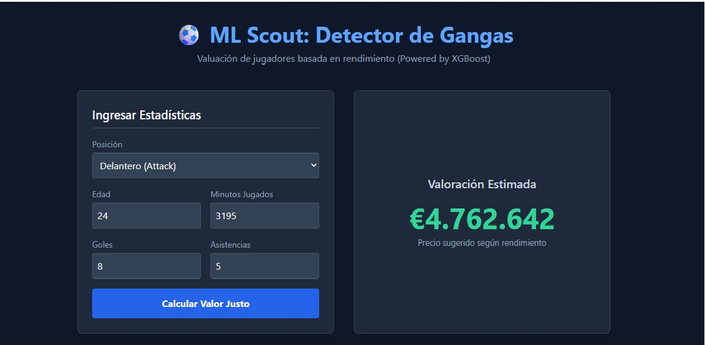

# ⚽ ML Scout: Detector de Gangas (Player Price Prediction)

> "Trabajaremos con un dataset alojado en un bucket, este será traido de Kaggle directamente alojado en el bucket. El objetivo es realizar un análisis exploratorio de los datos del dataset (datos de rendimiento y de partidos de jugadores de futbol), para generar mediante regresiones lineales un algoritmo que prediga el precio de un jugador según sus números..."

*(Nota Arquitectónica: Aunque la premisa original del proyecto inició explorando regresiones lineales, la solución final implementa un motor XGBoost para capturar con alta precisión las relaciones no lineales y las anomalías del mercado de fichajes).*

---
## 🚀 ¿Qué es esta herramienta?
**ML Scout** es una aplicación Full-Stack orientada a datos diseñada para detectar ineficiencias financieras en el mercado del fútbol. Permite valorar a los jugadores estrictamente por su rendimiento real.

## 🧠 Arquitectura
* **Data Lake:** AWS S3 (Ingesta desde Kaggle).
* **Motor Predictivo:** XGBoost serializado.
* **Backend:** FastAPI + Pydantic.
* **Frontend:** Tailwind CSS + Vanilla JS (Fetch API).
